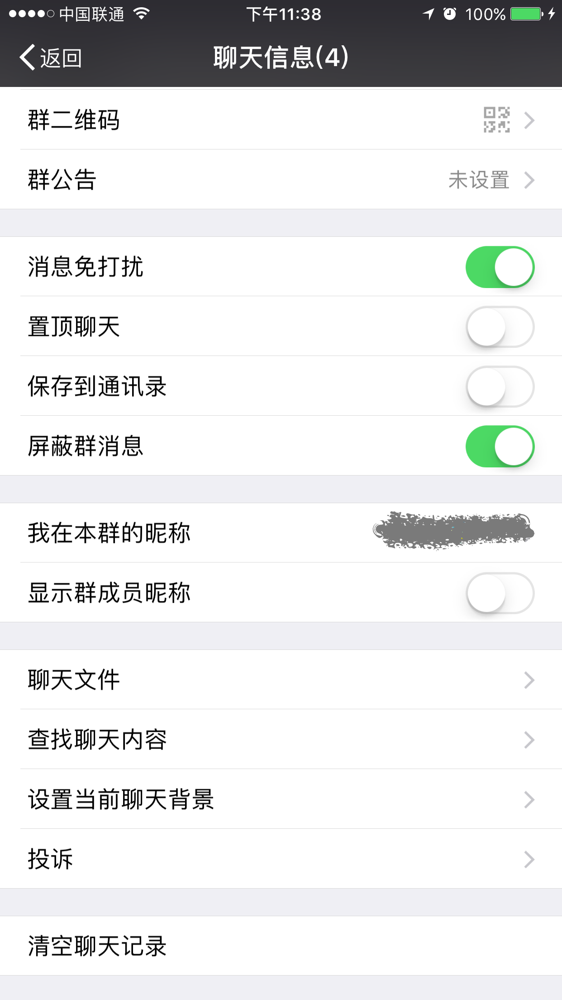

# FishChat

Hook WeChat.app on non-jailbroken devices.

## Features

- [x] 屏蔽群消息，好友消息（对方无察觉）
- [x] 关闭『发现』页面的『朋友圈』、『购物』和『游戏』入口
- [x] 修改微信运动步数
- [x] 去除各种小红点提示
- [x] 设置夜间模式
- [x] 阻止撤回消息

## Articles

[Make WeChat Great Again](http://yulingtianxia.com/blog/2017/02/28/Make-WeChat-Great-Again/)

[如何在逆向工程中 Hook 得更准 - 微信屏蔽好友&群消息实战](http://yulingtianxia.com/blog/2017/03/06/How-to-hook-the-correct-method-in-reverse-engineering)

## Screenshots

